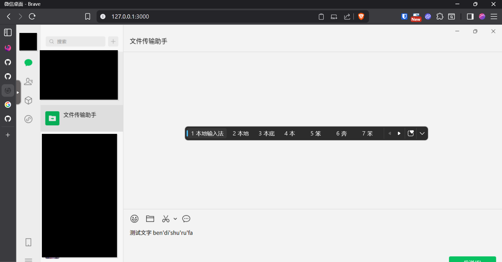

# WeChat VNC Docker


[中文文档 (Chinese README)](docs/README.zh.md)

This project provides a Dockerized VNC desktop environment for running WeChat on Linux, optimized for Chinese users.



## Features
- Auto-launches WeChat in a web-accessible VNC desktop
- Chinese language and font support
- Persistent config/data storage
- HTTP basic authentication support (optional)

## Usage

1. **Build and run the container:**
   ```bash
   docker compose up --build
   ```
   Access the VNC desktop via your browser at `http://localhost:3000`.

2. **Authentication:**
   To enable HTTP basic auth, set `CUSTOM_USER` and `PASSWORD` in `docker-compose.yml`.

3. **Chinese Language Support:**
   The container is pre-configured for Chinese locale and fonts. If you need other locales, adjust the `LC_ALL` environment variable.

4. **Input Method (IME) & Clipboard Sync:**
   - **IME Input Mode:**
     - After launching the VNC desktop, open the settings menu (gear icon) in the web UI.
     - Enable "IME Input Mode" to use local input methods.
   - **Clipboard Sync:**
     - In the same settings menu, enable both "Sync clipboard to container" and "Sync clipboard to client" for bidirectional clipboard sharing.
   - These settings are per-browser and may need to be enabled each session.

## Data Persistence
- All WeChat data is stored in the `wechat_data` directory on your host, mapped to `/config` in the container. For example, a file received in WeChat will be saved under `./wechat_data/xwechat_files/wxid_<XXX>/msg/file/<DATE>/<FILE_NAME>`.

## Troubleshooting
- If WeChat does not launch, check the Docker logs for errors.
- For font or input issues, verify the settings in the web UI and ensure your host system supports Chinese input.


### Reference Documentation
This image is based on the [linuxserver/kasmvnc](https://hub.docker.com/r/linuxserver/kasmvnc) image. For more customization options of KasmVNC, refer to:
- [KasmVNC base image options](https://docs.linuxserver.io/images/docker-baseimage-kasmvnc/)

Linuxserver.io provides a variety of mods which can be customized further. You can refer to the [linuxserver/docker-mods](https://github.com/linuxserver/docker-mods) repository to apply additional mods, such as internationalization, cloudflared, and etcher.


